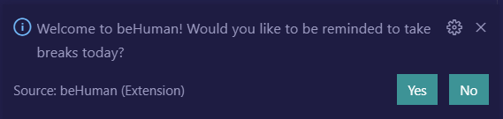
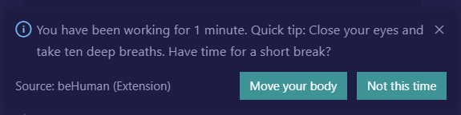
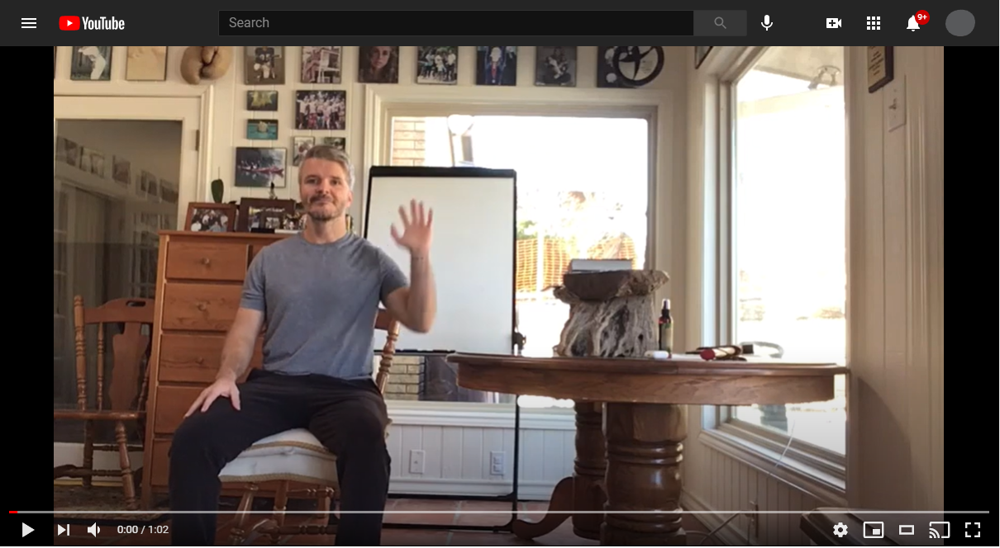

# beHuman

beHuman is a VSCode extension that reminds users to make healthy choices throughout their work day with both movement and mindful tips.

### Find us on LinkedIn:
- [Bryana](https://www.linkedin.com/in/bryanakitchen)
- [Franco](https://www.linkedin.com/in/francoortega)
- [Jillian](https://www.linkedin.com/in/jillianlgibson/)
- [Rhone](https://www.linkedin.com/in/rhonelachner/)
- [Shane](https://www.linkedin.com/in/shaneupchurch/)

## Features

Upon installing and enabling the extension, users will be asked if they wish to be reminded to take breaks:

If the user selects 'Yes,' alerts will be sent to them on the time increment chosen by the user (default is 60 minutes):

If the user clicks on "Move your body," they will be directed to an instructional video that incorporates body movements: 

>Note: Please consult your physician or other health care professional before starting a fitness plan, including the instructional videos provided in this extension. If you have any concerns or questions about your health, you should always consult with a physician or other health-care professional.

## Extension Settings

This extension contributes the following settings:
* `be-human.timeInterval`: Enter alert time increment in minutes

## User Commands

* 'be-human.resetTime' : resets time tracked and begins incrementing from zero.

## Known Issues

Upon changing the alert time interval in settings, the user will need to restart VSCode for the new time to go into effect.

## Release Notes

### 0.1.6
Test release to fix reset capabilities.

### 0.1.4
Test release to allow users to set custom alert time interval.

### 0.1.3
Test release repath logo so extension recognizes location.

### 0.1.2
Test release connects to the database and update logo.

### 0.1.1
Test release to check display name.

### 0.1.0
Test release to check file structure.

### 0.0.2
Test release fix publisher setup.

### 0.0.1
Test release for publisher setup.

