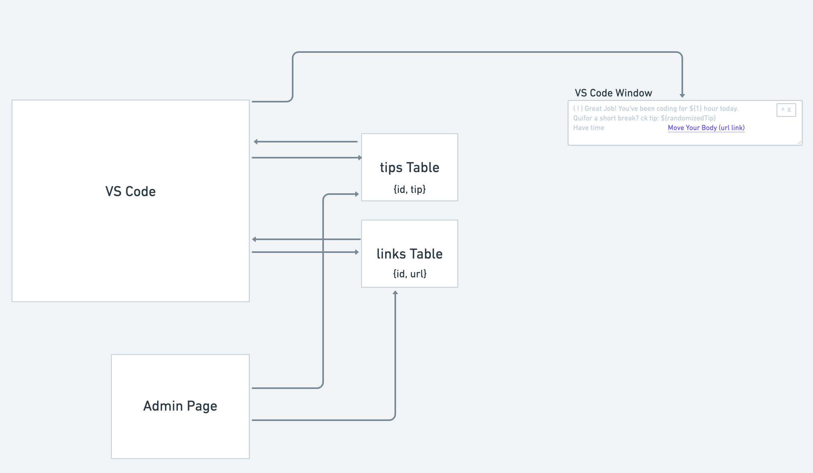

beHuman is a VSCode extension that reminds users to make healthy choices throughout their work day with both movement and mindful tips. Using a VSCode extension makes sending reminders very effective. 

Developers using VSCode may not see an email notification or SMS notification, but they will see a pop-up on their screen where they are working.  The extension tracks working time for the user, and allows the user to stay present in their tasks without looking at the clock. The time interval settings are customizable by the user, letting the user choose how long to work between breaks. Users will have the ability to pause or reset the time count if they wish to step away from the screen while VScode is open.

This Extension will never substitute physician guided advice, or regular exercise. Breaks are to be taken in conjunction with a healthy lifestyle including getting enough sleep and staying hydrated. Please consult a doctor if you have questions or concerns about any activity. We do not guarantee safety, and do not claim to be medical professionals. 

We care about your wellbeing and happiness! Studies show that taking breaks aids in productivity overall.
MVP and Stretch Goals can be found on our Whimsical board here: beHuman. 

Our app will have an admin page for our team members to be able to insert Tip data. We will not have a visible Sign Up option, which protects access.
